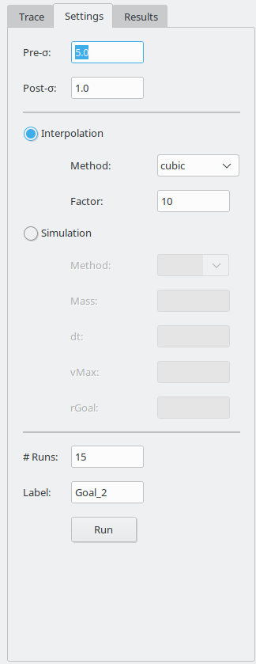

# TrajectoryGenerator
A trajectory-generator written in Python that creates trajectories from
a trace of user-given waypoints.

<p align="center">

<em>Example trajectories, generated with "TrajectoryGenerator".</em>
</p>

## Requirements

*TrajectoryGenerator* is written and tested with Python >= 3.6, but there 
are a number of additional packages required.

To avoid having to install all packages by hand, the usage of the 
[Anaconda](https://www.anaconda.com/) Python-distribution is recommended.
With *Anaconda* it is possible to have multiple, isolated Python-environments, each with a different set of packages.
The proper use of the *Anaconda* package management is documented [here](https://conda.io/docs/index.html).

For this project, all necessary dependencies are bundled in the top-level 
`environment.yml` file.

Simply run:
```
conda-env create -q -f environment.yml
```
to create a `conda`-environment containing all necessary packages called `TrajectoryGenerator`(this has to be done only once) and afterwards activate it by typing:
```
source activate TrajectoryGenerator
```
## Usage

To start the program, make sure the *TrajectoryGenerator*-environment is
activated and type:
```
python trajectoryGenerator.py
```
This will bring up the main screen of the application.

<p align="center">

<em>Start-up screen of the application, divided into two different halves.</em>
</p>

By default the program starts with an empty simulation-environment.
Different background-Images can be loaded via the menu-item
`Image -> Load Background`.

<p align="center">

<em>Loading a different simulation-environment.</em>
</p>


The main screen is divided into two different panels.

The left one (panel 1 in the image above) is used to display two different 
plots, the *Trace*- and the *Results*-plot.
The purpose of the *Trace*-plot is to show the user-given waypoints 
(which form a so called trace) and to
provide a more comfortable input-method to directly create waypoints by
clicking on the plot while the program is recording this waypoint-trace.
The *Results*-plot is used to show the generated trajectories.
One can switch between the two plots by clicking on their associated tab in
the left corner on top of the plots.

<p align="center">

<em>"Trace"-plot showing the trace of waypoints given by the user (left) and "Results"-plot showing 20 generated trajectories, based on the given trace (right).</em>
</p>

The right panel (panel 2) is used for the input of necessary parameters and
is divided into three different tabs.

<p align="center">

<em>"Trace"-tab with example trace.</em>
</p>

The first tab (*Trace*) displays the trace of waypoints the user can create.
This trace is shown as a list of points in the middle of the tab as an
automatically generated plot in the left *Trace*-plot panel.
There are three different methods of creating a trace.
First it can be done visually, by clicking on the button *Record Trace*
and then clicking inside the *Trace*-plot in the other panel.
It can also be done manually by clicking on the *+*-button on the bottom to
add a new point (set to *0,0*) and then editing the coordinates manually 
through double-clicking on the values inside the trace-list.
Lastly, it is also  possible to import a trace by
clicking on the *Load*-button.
This can be a previously generated trace, saved by clicking on *Save*-button,
or an arbitrary set of comma-separated values with one point per line, e.g.:

```
50,350
200,400
500,500
  ...
```

The possible methods of constructing of a trace is demonstrated in the 
following sequence:

<p align="center">

<em>Example of different methods to create and manipulate a "trace".</em>
</p>

The second tab of the right panel is the `Settings`-tab.
The purpose of this tab is to provide all necessary parameters for the 
generation of the trajectories.

<p align="center">

<em>"Settings"-tab with example values.</em>
</p>

On top are two fields to enter the values for the noise, used in the 
generation-process.
*Pre-$\sigma$* denotes gaussian noise (equally in *x*- and *y*-direction),
applied directly to the trace-values  **before** the generation of the 
trajectories. 
This is to create more diverse trajectories from one single trace.
The *Post-$\sigma$* value represents noise applied to the  **already finished** trajectories. This can be used to simulate measurement-noise. 

In the second part of the tab, the method to generate the trajectories 
can be chosen.

---
*This part is still a work in progress, so this tab is still very much 
subject to change*

---
As of now, only the `Interpolation`-method is fully implemented.
There, the supplied trace is interpolated by the selected `Method` to 
generate the trajectories.
The second parameter, `Factor`, indicates by which factor the resulting 
trajectories have more points than the original trace.
For example, a trace consisting of *10* points and a factor of *5* would
generate trajectories, *50* points long.

In the bottom part are two more parameters.
The first, `# Runs`, determines how many trajectories should be generated
with the given settings.
The `Label`-parameter is used to label the generated trajectories to tell 
them apart later on.

Finally on the very bottom is the *Run*-button, which starts the trajectory-generation.

Once the trajectories are generated, they are shown in the *Results*-plot 
and in the last tab of the right panel, the *Results*-tab.

<p align="center">

<em>"Results"-tab on the right with three generated trajectory-bundles.</em>
</p>

The *Results*-tab consists mainly of a list with all generated trajectories.
The are numbered and labeled by the `Label`-parameter of the *Settings*-tab.
In this list, undesired trajectories can be deleted by selecting them 
(multiple trajectories can be selected by holding shift) and the clicking
the *-*-button below the list.
If none of the simulated trajectories are good enough, all trajectories
can be deleted by clicking on *Clear All*.

After only the desired trajectories are selected, which can be done by 
clicking on the individually while holding *Shift* or by selecting all with
the *Select All*-button, the trajectories are ready to export by clicking
on the button named *Export*.
The trajectories are exported to the *.hdf5*-format.
More documentation on the advantages and the usage of *hdf5* can be found
[here](https://www.hdfgroup.org/).

The deletion and export of trajectories is shown in the following clip:

<p align="center">

<em>Deleting and exporting trajectories.</em>
</p>


## Example Workflow

The following clip shows an exemplary workflow for the generation of
two trajectory-bundles in a given room:


<p align="center">

<em>Example-workflow with "TrajectoryGenerator".</em>
</p>
